# Processo de desenvolvimento do projeto Criação de Layout
Neste processo de desenvolvimento, escolhi desenvolver com HTML, CSS e JavaScript.

⚠️ Obs.: Eu poderia fazer com Next.js, tailwind CSS e typescript, que são as tecnologias que uso. Porém, eu queria mostrar as minhas habilidades com as tecnologias raiz. Então, deixei pra fazer esse desafio com HTML, CSS e JavaScript mesmo. E caso desse tempo, devido a outras responsabilidades que tenho e levando em consideração que o requisito do desafio é escolher APENAS UM desafio, eu faria o outro projeto com as tecnologias que trabalho.

## O passo a passo de como vou começar
Será desenvolvendo toda a estrutura do site e estilização e após isso, farei a responsividade para que se adapte a todo tipo de tela. Por fim, colocarei as funcionalidades requisitadas.

Listando os passos:
- Estrutura e estilização com HTML e CSS
- Responsividade com CSS
- Funcionalidades com JavaScript

### Criação de página estática
Inicialmente comecei montando a parte estática do projeto, apenas com alguns elementos fracamente responsivos.
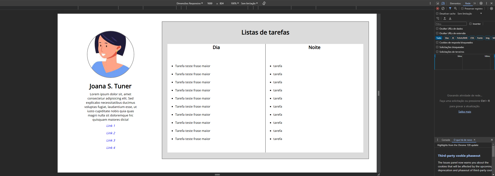

#### Sobre a estilização
Eu fiz a formatação dos links como se fosse as redes sociais da "usuária";

Coloquei um border radius nos elementos da caixa de lista de tarefas;

Vi que na documentação pede para serem listas ordenadas, então mudei o tipo da lista;

Coloquei uma cor mais agradável no background da sessão da lista.
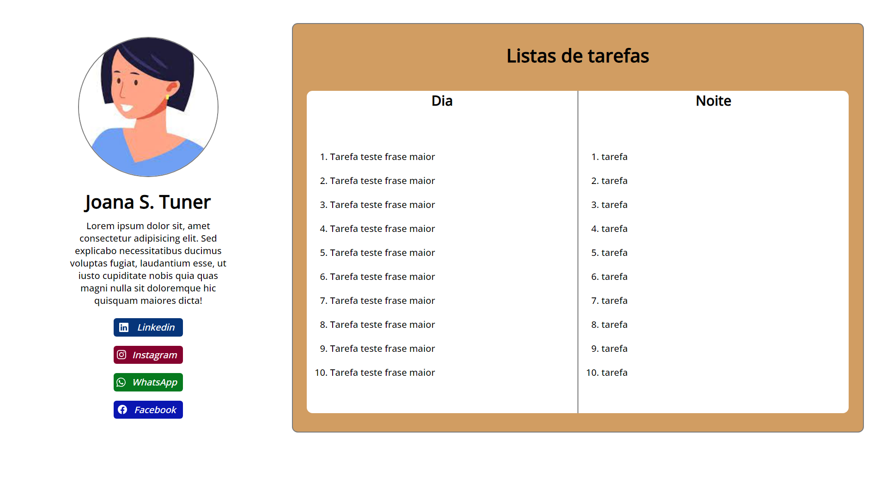

### Adicionei responsividade ao projeto
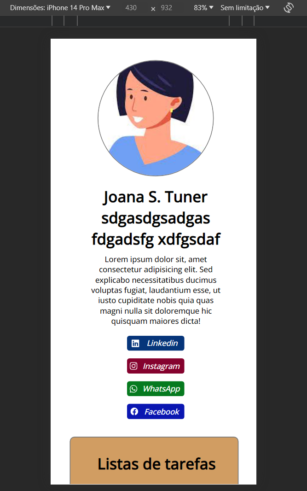
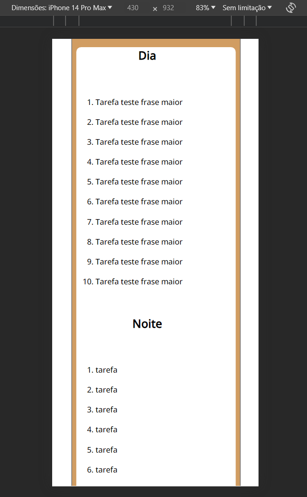
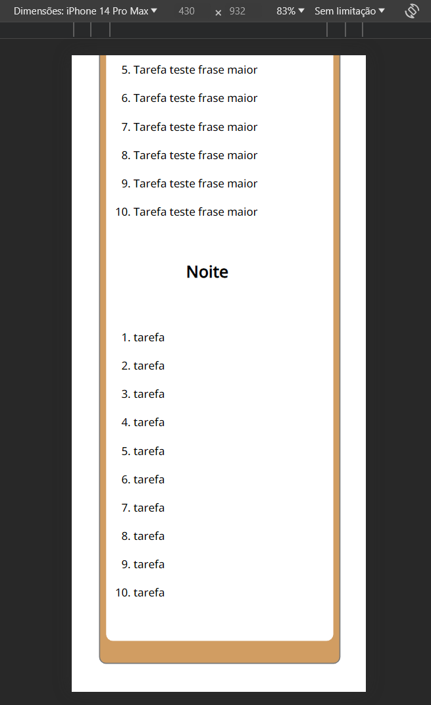

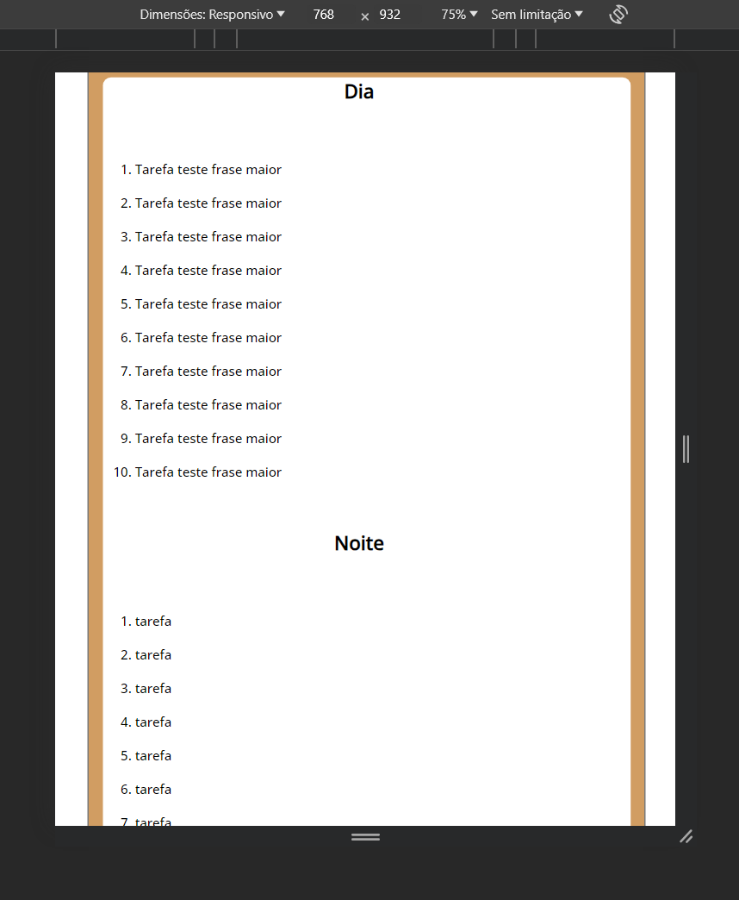
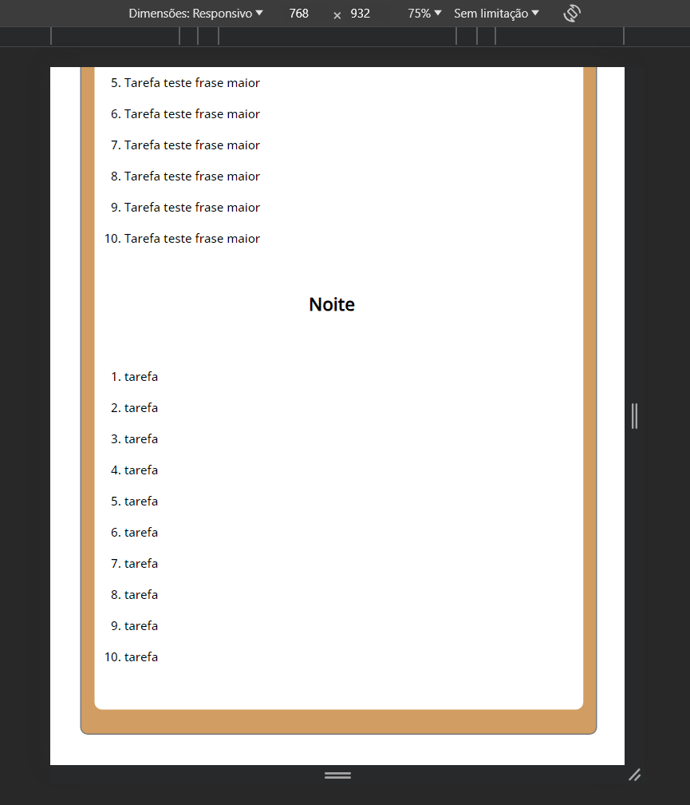

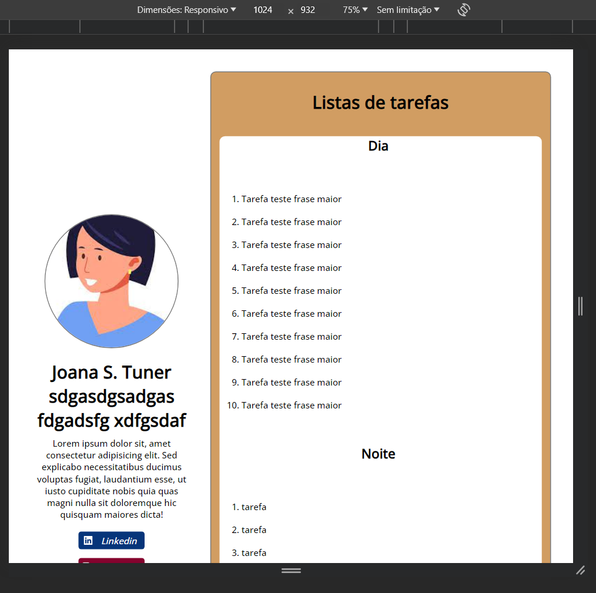
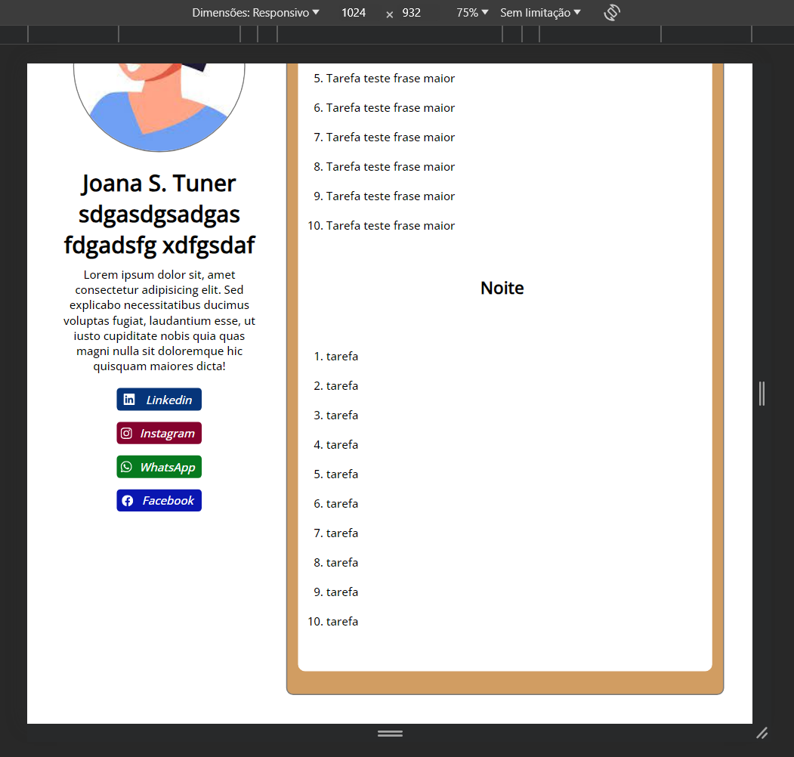

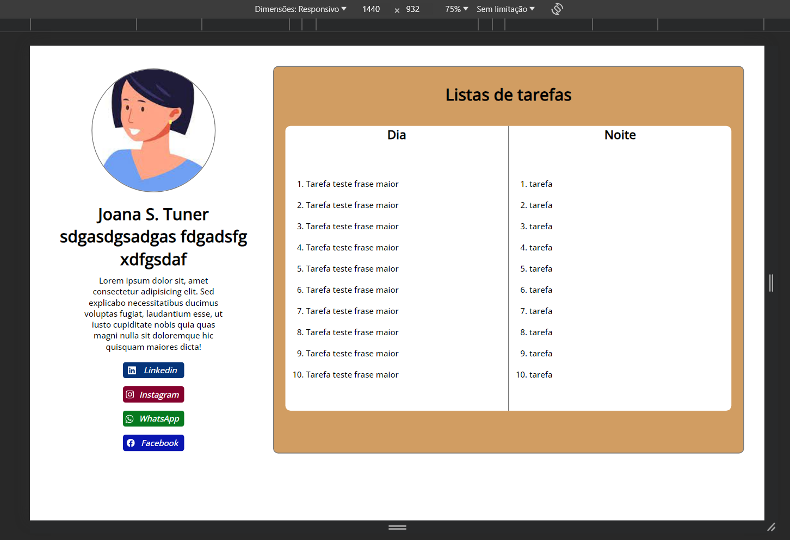

### Adicionei funcionalidades
Comecei adicionando na parte visual os botões de remover, que estão ao lado de cada item da lista, e os de adicionar novas tarefas, que então ao lado do título de cada sessão. Isso para que possa adicionar de acordo com as sessões.
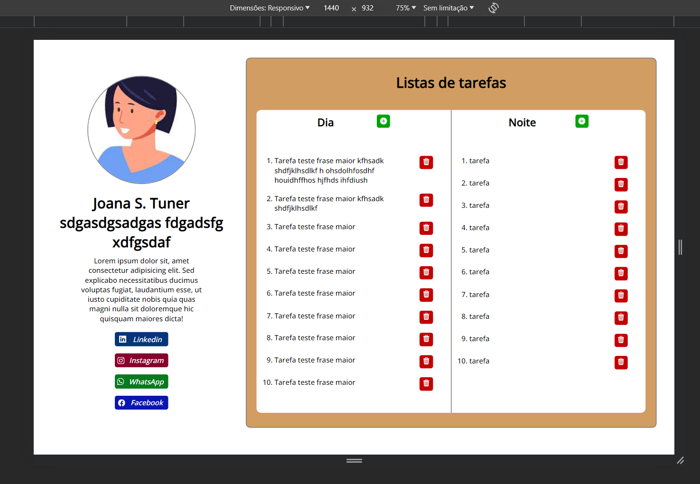