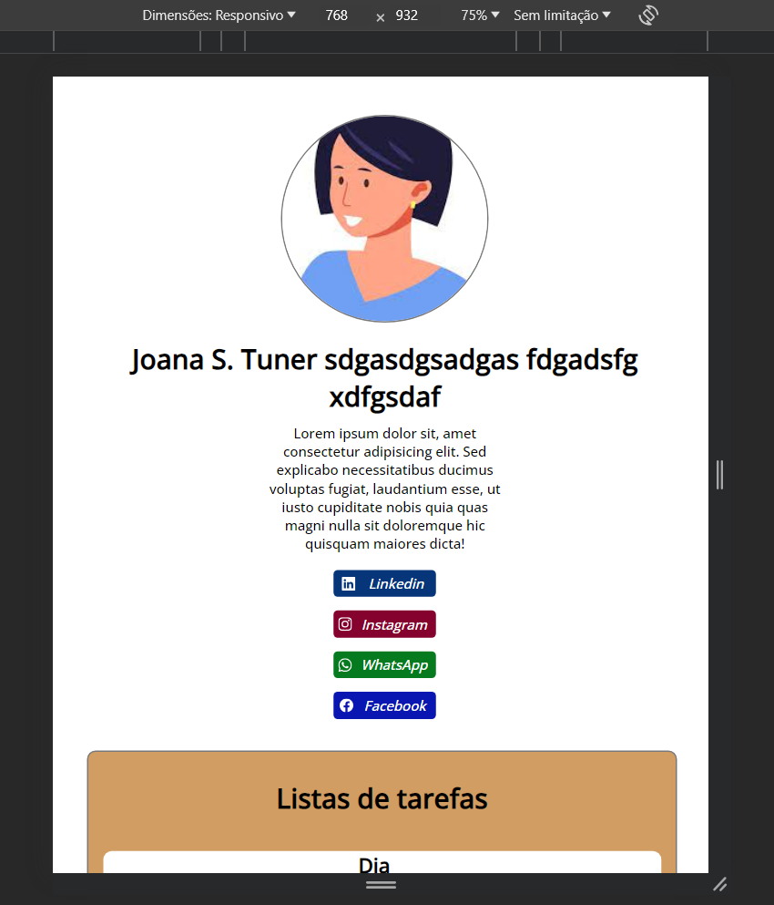

# Processo de desenvolvimento do projeto Criação de Layout
Neste processo de desenvolvimento, escolhi desenvolver com HTML, CSS e JavaScript.
O passo a passo de como vou começar será desenvolvendo toda a estrutura do site e estilização. Após isso, farei a responsividade para que se adapte a todo tipo de tela. Por fim, colocarei as funcionalidades requisitadas.

Listando os passos:
- Estrutura e estilização com HTML e CSS
- Responsividade com CSS
- Funcionalidades com JavaScript

### Criação de página estática
Inicialmente comecei montando a parte estática do projeto, apenas com alguns elementos fracamente responsivos.

#### Sobre a estilização
Eu fiz a formatação dos links como se fosse as redes sociais da "usuária";

Coloquei um border radius nos elementos da caixa de lista de tarefas;

Vi que na documentação pede para serem listas ordenadas, então mudei o tipo da lista;

Coloquei uma cor mais agradável no background da sessão da lista.

### Adicionei responsividade ao projeto

### Adicionei funcionalidades
...